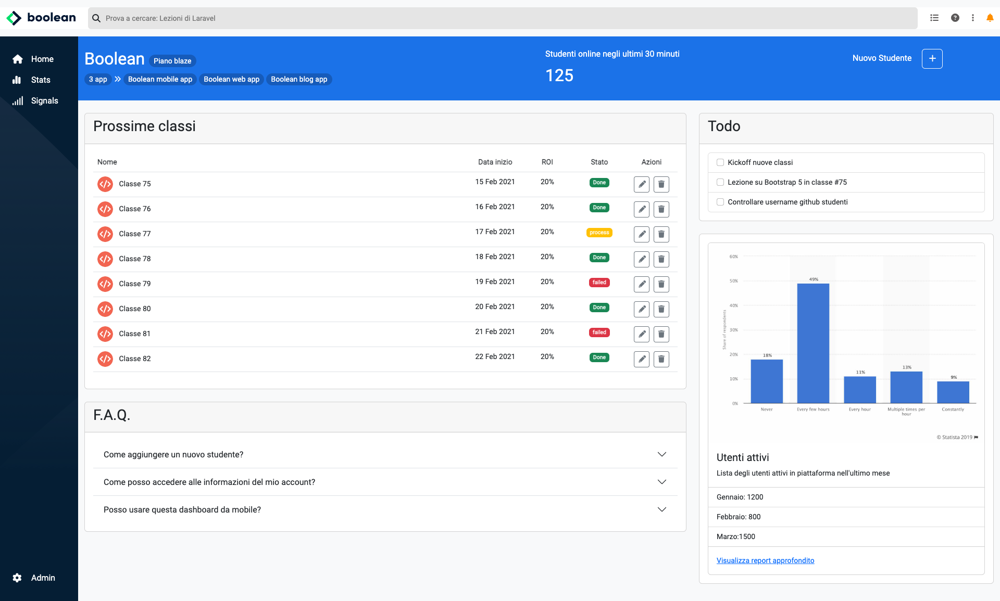
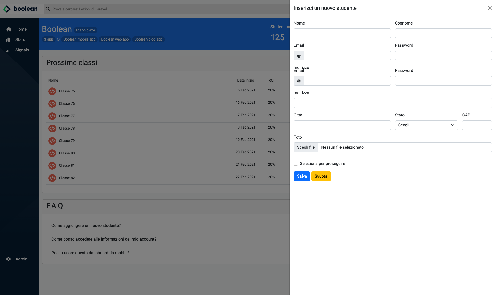
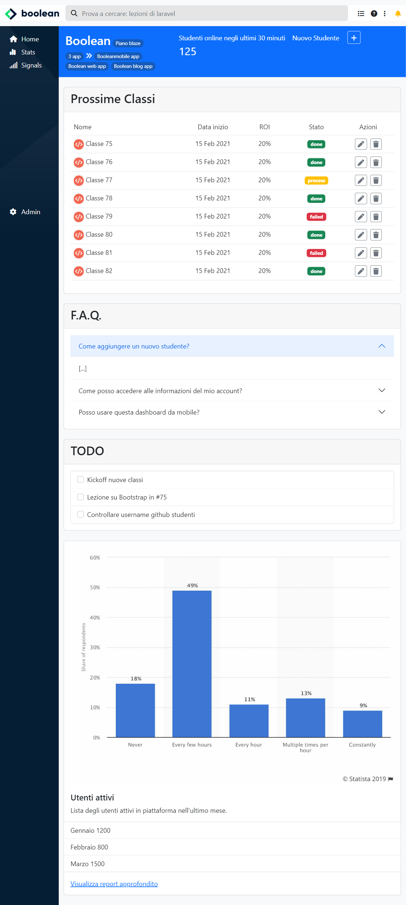
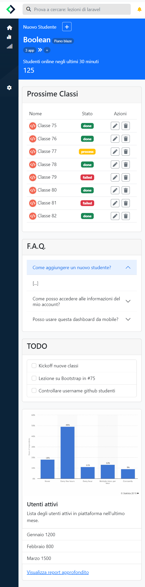

# Bootstrap 2-Dashboard

Secondo esercizio con il framework Bootstrap. In questo esercizio per evitare che il file style.css diventase troppo grande ho deciso di suddividerlo per argomenti in file diversi.

-   In **media_query.css** è contenuta la logica responsive per integrare le features non coperte da bootstrap.
-   In **debug.css** sono contenute le classi css che mi hanno aiutato per fare il layout a blocchi colorati.
-   In **app_web.css** è contenuto il layout della web-app composto dalla sidebar, navbar e dal main che è l'unica parte scrollabile.
-   E poi ci sono gli altri fogli di stile come **common.css** e **style.css**

<table cellpadding="0">
  <tr style="padding: 0">
    <td valign="top" align="center" width="50%">
        <h2 >Desktop 1</h2>
        
    </td>
    <td valign="top" align="center" width="50%">
        <h2 >Desktop 2</h2>
        
    </td>
  </tr>
    <tr style="padding: 0">
        <td valign="top" align="center" width="50%">
            <h2>Tablet</h2>
            
        </td>
        <td valign="top" align="center" width="50%">
            <h2>Mobile</h2>
            
        </td>
  </tr>
</table>
