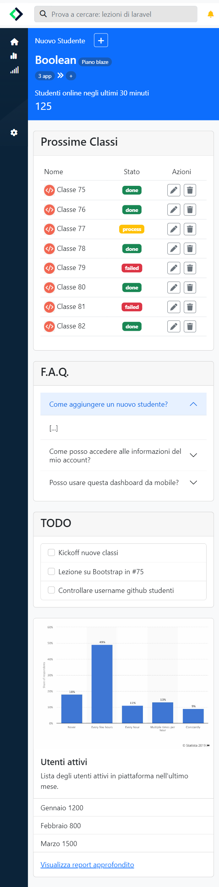

# html-css Bootstrap

**Initial commit**: 01/03/23

**Tecnologie:** HTML, CSS e Bootstrap.

**Info**: Here is my project with 🅱️ Bootstrap. I confess that the first approach was not easy, also because I had become fond of CSS, but then once I reached the top of the mountain there was no turning back, I understood the potential of a library and the speed of development that allows you to have.. fantastic! ⚡️

## Screenshot of [2-dashboard](/2-dashboard) excercise

<table cellpadding="0">
  <tr style="padding: 0">
    <td valign="top" align="center" width="50%">
      <h3 >Desktop 1</h3>
      
    </td>
    <td valign="top" align="center" width="50%">
      <h3 >Desktop 2</h3>
      
    </td>
  </tr>
  <tr style="padding: 0">
    <td valign="top" align="center" width="50%">
      <h3>Tablet</h3>
      
    </td>
    <td valign="top" align="center" width="50%">
      <h3>Mobile</h3>
      
    </td>
  </tr>
</table>
